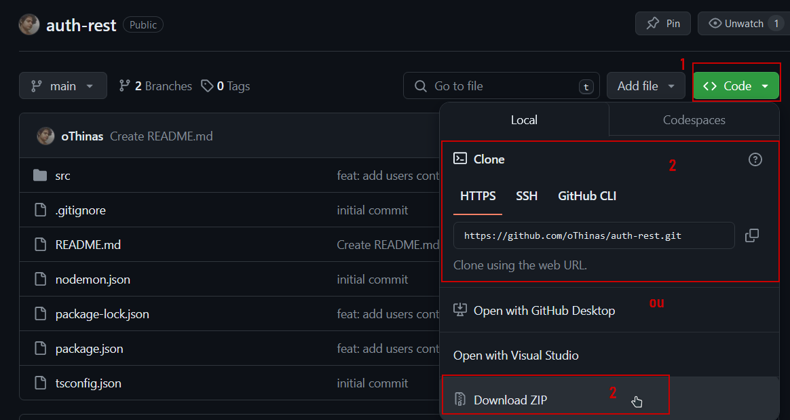

# Instruções

- Instale o NodeJS e o NPM:
```
$ sudo apt-get update
$ sudo apt-get upgrade

Instale o curl
$ sudo apt-get install curl

Instale o repositório NodeSource
$ curl -fsSL https://deb.nodesource.com/setup_18.x | sudo -E bash -

Instale o NodeJS e o NPM
$ sudo apt-get install nodejs

Para confirmar:
$ node -v
$ npm -v
```

- Clone esse repositório ou faça download do zip e extraia os arquivos:


- Acesse o repositório:
```
$ cd [nome da pasta]/[nome da pasta]/auth-rest
```

- Instale as dependências necessárias:
```
$ npm i
```

- Crie um arquivo .env na pasta raiz do projeto:
```
$ touch .env
```

- Nesse arquivo, cole o texto que vou te mandar no whatsapp

- Rode o projeto:
```
$ npm run start
```

# Requisições disponíveis:
- /auth/register
  - Method: POST
  - body: {
      "email": string,
      "password": string,
      "username": string
    }

- /auth/login
  - Method: POST
  - body: {
      "email": string,
      "password": string
    }

---
> Obs: só é possível executar essa ação caso esteja logado
- /users
  - Method: GET

> Obs: só é possível executar essa ação caso esteja logado com o usuário que está tentando excluir
- /users/{id}
  - Method: DELETE

> Obs: só é possível executar essa ação caso esteja logado com o usuário que está tentando alterar
- /users/{id}
  - Method: PATCH
  - body: {
    username: string
  }
